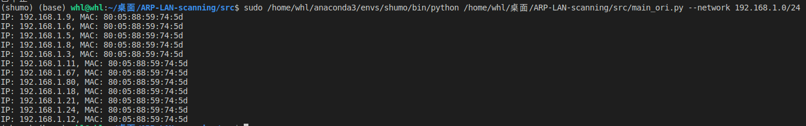
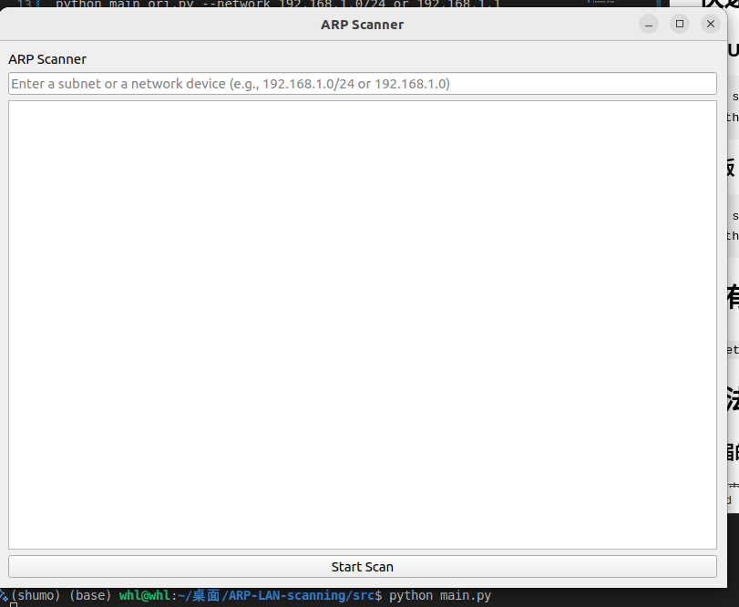
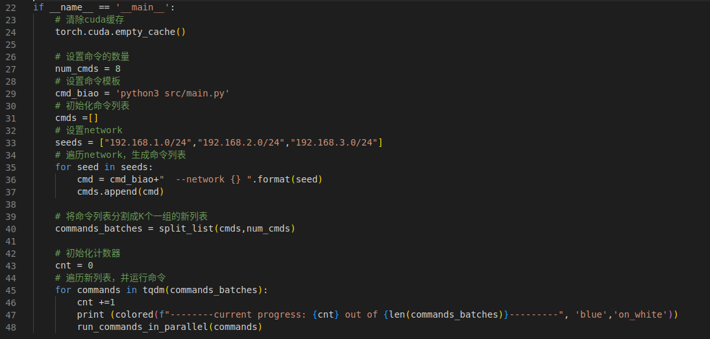
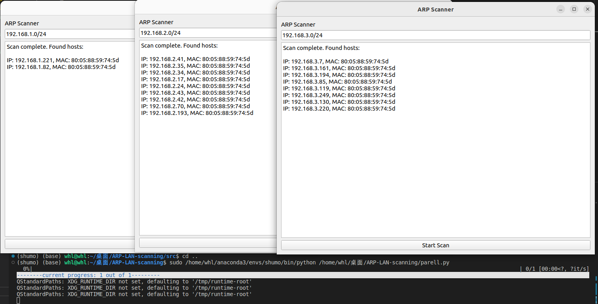
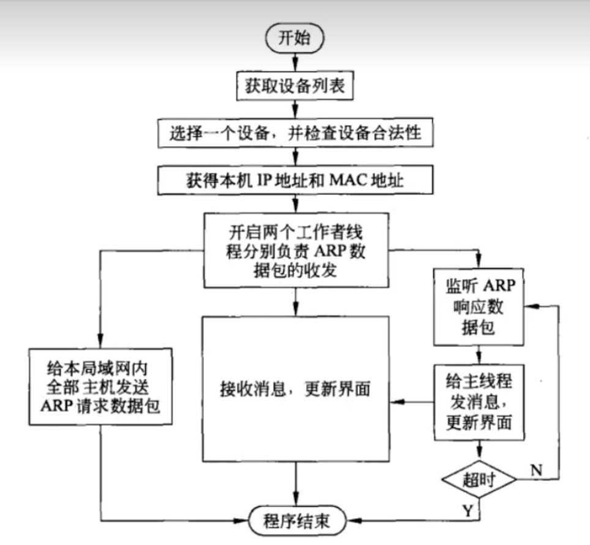

## 简介
一个基于ARP协议查询局域网内某网段所有设备ip及mac地址的小工具，每个版本都有应用多线程技术，同时发送多个ARP请求以加快扫描速度。

---

设计题目：设计一个基于ARP协议的局域网扫描程序。
设计要求：使用指定的网段IP地址范围，通过ARP协议扫描局域网内活跃主机的MAC地址。实现ARP请求和应答过程，获取目标主机的MAC地址。
技术要求：
1.利用编程语言如Python或C++实现程序，理解并实现ARP协议的发送和接收。
2. 应用多线程技术，同时发送多个ARP请求以加快扫描速度。
3. 对于收到的ARP应答包，解析其中的MAC地址信息并输出。
## 运行环境
Windows和linux都行，要有Python3及依赖(无UI版不需要安装QT)

```
pip install -r requirements.txt
```


## 快速运行 (或许要加sudo)
#### No UI版(不需要安装QT)
```
cd src
python main_ori.py --network 192.168.1.0/24 or 192.168.1.1
```

#### UI版
```
cd src
python main.py #也可指定network
```

#### 多终端同时查询
先配置parell.py中的seeds(为你想查询的ip或网段)和命令模板(main.py是有ui,main_ori.py是无ui)


```
#再在项目的根目录下运行
python parell.py
```

## 所有参数

`--network 192.168.1.0/24 or 192.168.1.1`: 填网段或IP
## 算法流程

## 项目目录
```
.
├── assets
├── debugTrain.py
├── LICENSE
├── parell.py
├── README.md
├── requirements.txt
└── src
    ├── main_ori.py
    ├── main.py
    ├── parser.py
    ├── __pycache__
    │   └── parser.cpython-310.pyc
    ├── scripts
    └── utils
        └── __pycache__
            └── ARPscan.cpython-310.pyc

```

6 directories, 10 files

如果您觉得有帮助，请帮忙点个star 🌟
